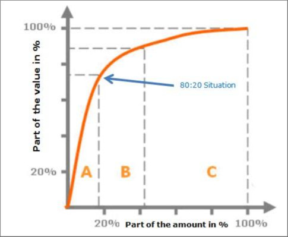
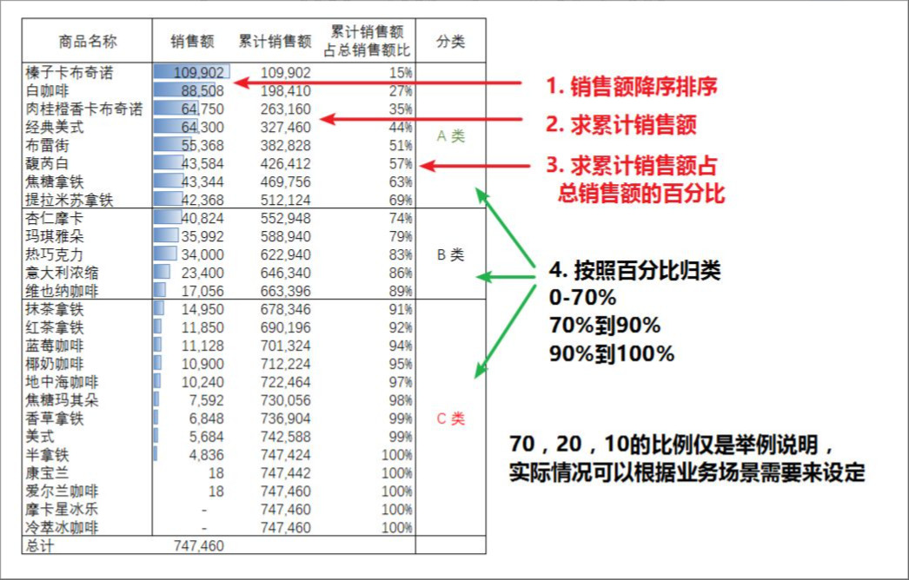

# 讯捷集团 帕累托(Pareto) 销售额分析 说明手册(Manual) 2023-11-19

#### 2023-11-19 22:55

#### 讯捷集团_帕累托(Pareto)_销售额分析_说明手册(Manual)_2023-11-19.md

--------------------------------------------------

### 帕累托(Pareto)与ABC分类法

很多人都知道 80/20 帕累托法则(20%的人掌握着80%的财富), 而ABC分类法可以说是该法则的衍生, 目的是把握关键, 分清主次。



比如一共有100件商品,

10件商品占销售总额的70%;

20件商品占销售总额的20%;

还有70件商品仅占销售总额的10%。

1879年, 自伟大的帕累托创造了该法则后, 该方法不断地应用在管理的各个方面, 从库存管理、质量管理、销售管理甚至到社会分析, 成为企业提高效益的普遍管理方法。

只不过在没有计算器的年代, 人民群众应该是用纸笔按照下面的步骤来计算的。



--------------------------------------------------

### 分析维度(Analysis Dimension)

* 例如: 按产品、按城市、按营业员等维度, 其维度就是[产品]、[城市]、[营业员]。

* 其维度明细(Dimension Detail)就是 X 轴数据(X-Axis Data)

#### Power BI 操作:

建立如下二维表格, 表格内容如下所示:

|Dimension |Dimension_Detail  |
|----      |----              |
|配件      |充电器A           |
|配件      |数据线A           |
|主机      |iPhone 15         |
|主机      |HUAWEI P50        |
|人员      |张三              |
|人员      |李四              |
|门店      |西安形象          |
|门店      |云南形象          |

也可以通过DAX函数建表直接从数据表拉取相应维度数据(通过对原表数据的去重实现):

```dax

Dimension = 
VAR D01 = SELECTCOLUMNS(
              ADDCOLUMNS(
                  DISTINCT('Pareto_Data'[产品类别]),
                  "New_Built_Dimension", "产品"
                  ),
                  "Dimension", [New_Built_Dimension],
                  "Dimension_Detail", [产品类别]
          )
VAR D02 = SELECTCOLUMNS(
              ADDCOLUMNS(
                  DISTINCT('Pareto_Data'[门店名称]),
                  "New_Built_Dimension", "门店"
                  ),
                  "Dimension", [New_Built_Dimension],
                  "Dimension_Detail", [门店名称]
          )
RETURN UNION(D01, D02)

```

--------------------------------------------------

### 维度指标(Dimension Indicator)

* 例如: 按销售额、按订单量、按毛利率等数据来对相应维度进行展现, 其维度数据就有[销售额]、[订单量]、[毛利率]。

#### Power BI 操作:

建立如下二维表格, 以便于用于"Power BI 切片器"表格内容如下所示:

|Number |Indicator |
|----   |----      |
|1      |销售额    |
|2      |订单量    |
|3      |毛利率    |

也可以通过DAX函数建表直接建立相应指标:

```dax

Indicator = 
UNION(
    ROW("Number",1, "Indicator", "销售额"),
    ROW("Number",2, "Indicator", "订单量")
)

```

--------------------------------------------------

### 维度指标选择器(Dimension Indicator Selector)

#### Power BI 操作:

建立度量值(Measure):

```dax

Selector_Indicator = 
SWITCH(TRUE(),
SELECTEDVALUE('Indicator'[Indicator])="销售额", CALCULATE(SUM('Pareto_Data'[销售额])),
SELECTEDVALUE('Indicator'[Indicator])="订单量", CALCULATE(COUNT('Pareto_Data'[日期])),
BLANK()
)

```

--------------------------------------------------

### 销售额合计(Total Sales)

#### Power BI 操作:

建立度量值(Measure):

```dax

Total_Sales = CALCULATE(SUM('Pareto_Data'[销售额]))

```

--------------------------------------------------

### 订单量合计(Total Order Quantity)

#### Power BI 操作:

建立度量值(Measure):

```dax

Total_Order_Quantity = CALCULATE(COUNT('Pareto_Data'[日期]))

```

--------------------------------------------------

### 按维度指标合计(Total By Dimension Indicator)

#### Power BI 操作:

建立度量值(Measure):

```dax

Total_By_Dimension_Indicator = 
SWITCH(TRUE(),
SELECTEDVALUE('Indicator'[Indicator])="销售额", CALCULATE([Total_Sales], ALLSELECTED('Pareto_Data'[销售额])),
SELECTEDVALUE('Indicator'[Indicator])="订单量", CALCULATE([Total_Order_Quantity], ALLSELECTED('Pareto_Data'[日期])),
BLANK()
)

```

--------------------------------------------------

### 维度明细各自占比(Dimension Detail Each Proportion)

#### Power BI 操作:

建立度量值(Measure):

```dax

Dimension_Detail_Each_Proportion = DIVIDE([Y_Axis_Data], [Total_By_Dimension_Indicator])

```

--------------------------------------------------

### Y 轴数据(Y-Axis Data)

* Y 轴数据是以柱状的形式按 X 轴排列, 例如 X 轴坐标为"HUAWEI P50", 那么 Y 轴对应的则是"HUAWEI P50"的销量。

#### Power BI 操作:

由于动态展现, 将根据"分析维度"表格切片展示, 故采用建立虚表的拟连接的方式按维度明细拉取数据表中的数据。

建立度量值(Measure):

```dax

Y_Axis_Data = 
VAR item3=TREATAS(VALUES('Dimension'[Dimension_Detail]), 'Pareto_Data'[产品类别])
VAR item4=TREATAS(VALUES('Dimension'[Dimension_Detail]), 'Pareto_Data'[门店名称])
RETURN
    SWITCH(TRUE(),
    SELECTEDVALUE('Dimension'[Dimension])="产品", CALCULATE([Selector_Indicator], item3),
    SELECTEDVALUE('Dimension'[Dimension])="门店", CALCULATE([Selector_Indicator], item4),
    BLANK()
    )

```

--------------------------------------------------

### 辅助 Y 轴数据(Auxiliary_Y-Axis_Data)

#### Power BI 操作:

建立度量值(Measure):

```dax

Auxiliary_Y-Axis_Data = 
VAR cur_rate = CALCULATE(DIVIDE([Y_Axis_Data], [Total_By_Dimension_Indicator]))
RETURN
CALCULATE([Dimension_Detail_Each_Proportion], FILTER(ALL('Dimension'[Dimension_Detail]), [Dimension_Detail_Each_Proportion] >= cur_rate))

```

--------------------------------------------------
### EOF
